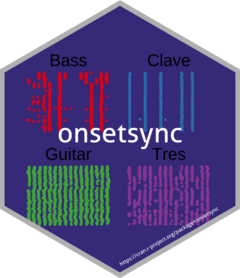

<!-- README.md is generated from README.Rmd. Please edit that file -->

```{r, include = FALSE}
knitr::opts_chunk$set(
  collapse = TRUE,
  comment = "#>",
  fig.path = "man/figures/README-",
  out.width = "75%"
)
```

# onsetsync - Analysis and Visualisation of Synchronisation of Music Onset Data


<!-- badges: start -->
[](https://lifecycle.r-lib.org/articles/stages.html#experimental)
<!-- badges: end -->

`onsetsync` is a R package for musical assessing synchrony between onsets in music.  There are functions for common operations such as adding isochronous beats based on metrical structure, adding annotations, calculating classic measures of synchrony between performers, and assessing periodicity of the onsets, and visualising synchrony across cycles, time, or another property.

## Installation

You can install the current version of `onsetsync` from Github by
entering the following commands into R:

```{r,eval=FALSE}
if (!require(devtools)) install.packages("devtools")
devtools::install_github("tuomaseerola/onsetsync")
```

## Usage


```{r, message=FALSE, warning=FALSE,echo=TRUE}
library(onsetsync)
library(dplyr)
library(ggplot2)
packageVersion("onsetsync")
```
### Reading in data

Read onsets of one Cuban Son performance titled _Palo Santo_ from _IEMP_ dataset at [https://osf.io/sfxa2/](https://osf.io/sfxa2/). This song has the onsets and the annotations about the metric cycles already extracted and defined and **comes with the package**.

<iframe src="https://mfr.osf.io/render?url=https://osf.io/z9uxs/?direct%26mode=render%26action=download%26public_file=True&amp;initialWidth=700&amp;childId=mfrIframe&amp;parentTitle=OSF%20%7C%20CSS_Song2_StereoMix.wav&amp;parentUrl=https%3A%2F%2Fosf.io%2Fz9uxs%2F" width="100%" scrolling="yes" marginheight="0" frameborder="0" allowfullscreen="" webkitallowfullscreen="" sandbox="allow-scripts allow-popups allow-same-origin" height="150px"></iframe>


```{r message=FALSE,warning=FALSE,eval=TRUE,results='asis'}
CSS_Song2 <- onsetsync::CSS_IEMP[[2]]   # Read one song from internal data
CSS_Song2 <- dplyr::select(CSS_Song2,Label.SD,SD,Clave,Bass,Guitar,Tres,
                           CycleTime,Cycle,Isochronous.SD.Time) # Select some columns
print(knitr::kable(head(CSS_Song2),format = "simple",digits = 2))
```

Reading data from is easy either from CSV files in your computer or directly from OSF using `get_OSF_csv` function. 

### Visualise onsets structures

As an overview, we can visualise the onsets across the beat sub-divisions for each instrument and do this across the time. Note that time run vertically (from bottom to up) here.

```{r synch2isochron,fig.width=7, fig.asp=.75}
fig1 <- plot_by_beat(df = CSS_Song2, 
                     instr = c('Bass','Clave','Guitar','Tres'), 
                     beat = 'SD', 
                     virtual='Isochronous.SD.Time',
                     pcols=2)
print(fig1)
```

### Calculate asynchronies

To what degree are the pairs of instruments synchronised to each other? Let's visualise the synchrony of all pairings of the instruments in this example.

```{r fig2,warning=FALSE,fig.width=7, fig.asp=.7}
inst <- c('Clave','Bass','Guitar','Tres') # Define instruments 
dn <- sync_execute_pairs(CSS_Song2,inst,0,1,'SD')
fig2 <- plot_by_pair(dn)  # plot
print(fig2)  
```

As we saw in the first figure, the instruments usually play widely different amounts of onsets in a piece, and these are bound to be at different beats sub-divisions, the mutual amount of comparable onsets for each pair often varies dramatically. Comparison of mean asynchronies across sub-divisions can be facilitated by taking random samples of the joint onsets. Here we choose a random 200 matching onsets and re-calculate the comparison of asynchrony with this subset 1000 times.

```{r paired1}
set.seed(1234) # set random seed
N <- 200 # Let's select 200 onsets
Bootstrap <- 1000
d1 <- sync_sample_paired(CSS_Song2,'Clave','Bass',N,Bootstrap,'SD',TRUE)
print(paste('Mean asynchrony of',round(mean(d1$asynch*1000),1),
    'ms & standard deviation of',round(sd(d1$asynch*1000),1),'ms'))
```
There are other measures to summarise the asynchronies and visualise them. 

### Calculate synchrony across performances

We can apply the measures to a corpus of performances. Here we load five Cuban Son and Salsa performances and run the same analysis as above across the performances.

```{r corpus, warning=FALSE, message=FALSE, eval=TRUE,fig.width=6.0}
corpus <- onsetsync::CSS_IEMP
D <- sync_sample_paired(corpus,'Tres','Bass',N=0,beat='SD')
D <- D$asynch
D$asynch_abs <- abs(D$asynch)*1000
fig3 <- plot_by_dataset(D,'asynch_abs','name', box = TRUE)
print(fig3)
```

For more examples, see [documentation](https://tuomaseerola.github.io/onsetsync/) and associated [paper IN PROGRESS](http://).

#### Note: How do I get onsets from my music?

Note that `onsetsync` is not dedicated to extraction of onsets from audio as that should be done using other tools (e.g. [Librosa](https://librosa.org), or [MIR Toolbox for Matlab](https://www.jyu.fi/hytk/fi/laitokset/mutku/en/research/materials/mirtoolbox), or [Sonic Visualiser](https://www.sonicvisualiser.org) using established onset detection algorithms). Here we assume that you have extracted the onsets of the music from a recording already in one of these tools, and preferably checked them by hand. It is already more meaningful to carry out analyses of synchrony when you have the metrical information (cycles and beats) identified. If your starting point is MIDI, getting the onsets is just a conversion operation away (I would recommend [music21](https://web.mit.edu/music21/doc/moduleReference/moduleConverter.html) for this purpose), although annotation might still be required.

