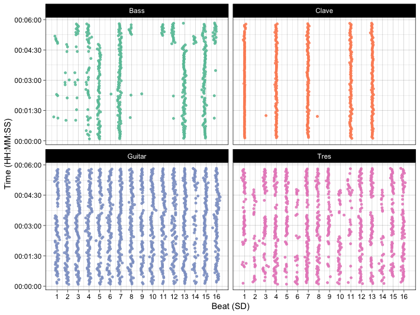

<!-- README.md is generated from README.Rmd. Please edit that file -->

# onsetsync - Analysis and Visualisation of Synchronisation of Music Onset Data

<!-- badges: start -->

[](https://lifecycle.r-lib.org/articles/stages.html#experimental)
<!-- badges: end -->

`onsetsync` is a R package for musical dynamics involving synchrony.
There are functions for common operations such as adding isochronous
beats based on metrical structure, adding annotations, calculating
classic measures of synchrony between two performers, and assessing
periodicity of the onsets, and visualising synchrony across cycles,
time, or another property.

## Installation

You can install the current version of `onsetsync` from Github by
entering the following commands into R:

``` r
if (!require(devtools)) install.packages("devtools")
devtools::install_github("tuomaseerola/onsetsync")
```

## Usage

Note that `onsetsync` is not dedicated to extraction of onsets from
audio as that can be done in other packages
(e.g. [Librosa](https://librosa.org), or [Mir Toolbox for
Matlab](https://www.jyu.fi/hytk/fi/laitokset/mutku/en/research/materials/mirtoolbox),
or [Sonic Visualiser](https://www.sonicvisualiser.org) using well-known
onset detection algorithms. Here we take it as granted that we have
extracted the onsets in some of these programs, probably checked them by
hand, and we have the onset times recorded into the csv files.

``` r
library(onsetsync)
library(httr)
library(dplyr)
library(ggplot2)
```

``` r
CSS_Song2_Onset <- get_OSF_csv('8a347') # Onsets
knitr::kable(head(CSS_Song2_Onset[,1:8,]),format = "simple")
```

| Piece   | Label.SD |  SD | Clave\_. | Section | Clave |     Bass |   Guitar |
|:--------|:---------|----:|:---------|:--------|------:|---------:|---------:|
| Song\_2 | 1:1      |   1 | 1        | Son     |    NA |       NA |       NA |
| Song\_2 | 1:2      |   2 | N        | Son     |    NA |       NA | 5.281932 |
| Song\_2 | 1:3      |   3 | N        | Son     |    NA |       NA | 5.480643 |
| Song\_2 | 1:4      |   4 | 2        | Son     |    NA | 5.714555 | 5.707537 |
| Song\_2 | 1:5      |   5 | N        | Son     |    NA | 5.927078 | 5.939071 |
| Song\_2 | 1:6      |   6 | N        | Son     |    NA |       NA | 6.153243 |

``` r
CSS_Song2_Metre <- get_OSF_csv('4cdpr') # Annotations
CSS_Song2_Onset <- dplyr::select(CSS_Song2_Onset,
                                 Label.SD,SD,Clave,Bass,Guitar,Tres) 
```

As the onsets and annotations are in different files, let’s first
combine the raw onset and annotation with `onsetsync`. Here we first add
annotations (using `add_annotation` function) about the cycles into the
onset data. We then add isochronous beat times to the data frame using
`add_isobeats`, since these are useful reference points for synchrony
calculations.

``` r
# Add annotations about the cycle to the data frame
CSS_Song2 <- add_annotation(df = CSS_Song2_Onset,
                            annotation = CSS_Song2_Metre$Cycle,
                            time = CSS_Song2_Metre$Time,
                            reference = 'Label.SD')
# Add isochronous beats to the data frame
CSS_Song2 <- add_isobeats(df = CSS_Song2, 
                          instr = 'CycleTime', 
                          beat = 'SD')

print(knitr::kable(head(CSS_Song2),format = "simple",digits = 2))
```

| Label.SD |  SD | Clave | Bass | Guitar | Tres | CycleTime | Cycle | Isochronous.SD.Time |
|:---------|----:|------:|-----:|-------:|-----:|----------:|------:|--------------------:|
| 1:1      |   1 |    NA |   NA |     NA |   NA |      5.04 |     1 |                5.04 |
| 1:2      |   2 |    NA |   NA |   5.28 |   NA |        NA |     1 |                5.26 |
| 1:3      |   3 |    NA |   NA |   5.48 |   NA |        NA |     1 |                5.48 |
| 1:4      |   4 |    NA | 5.71 |   5.71 | 5.73 |        NA |     1 |                5.71 |
| 1:5      |   5 |    NA | 5.93 |   5.94 | 5.92 |        NA |     1 |                5.93 |
| 1:6      |   6 |    NA |   NA |   6.15 | 6.14 |        NA |     1 |                6.15 |

Before moving onto the analysis, let’s summarise the onset structures in
this piece.

``` r
tab1 <- summarise_onsets(df = CSS_Song2, 
                         instr = c('Clave','Bass','Guitar','Tres'))
print(knitr::kable(tab1,digits = 1,
     caption = 'Descriptives for the onset time differences (ms)'))
```

|        |    N |    Md |     M |    SD |   Min |    Max |
|:-------|-----:|------:|------:|------:|------:|-------:|
| Clave  |  486 | 666.4 | 703.6 | 173.9 | 192.0 | 1558.1 |
| Bass   |  486 | 471.4 | 708.1 | 432.0 | 180.0 | 1985.2 |
| Guitar | 1401 | 223.6 | 244.5 |  91.4 | 175.1 | 1694.9 |
| Tres   |  906 | 245.0 | 371.4 | 234.6 | 147.1 | 1986.5 |

Descriptives for the onset time differences (ms)

As a broad overview, we can visualise the relative synchrony to equal
division subdivision of the beat for each instrument across the time.

``` r
fig1 <- plot_by_beat(df = CSS_Song2, 
                     instr = c('Bass','Clave','Guitar','Tres'), 
                     beat = 'SD', 
                     virtual='Isochronous.SD.Time',
                     pcols=2)
print(fig1)
```



There are several variants of this summary, but let’s move on.

To what degree are the pairs of instruments synchronised in this
example? Since the instruments usually play widely different amounts of
onsets in a piece, and these are bound to be at different beats
sub-divisions, the mutual amount of comparable onsets for each pair
varies often dramatically. In order to keep the mean and standard
deviations comparable, we will randomly sample joint onsets for both
instruments.

``` r
set.seed(1201) # set random seed
N <- 200 # Let's select 200 onsets
d1 <- sync_sample_paired(CSS_Song2,'Clave','Bass',N,1,'SD',TRUE)
#> [1] "onsets in common: 241"
print(paste('Mean asynchrony of',round(mean(d1$asynch*1000),1),
    'ms & standard deviation of',round(sd(d1$asynch*1000),1),'ms'))
#> [1] "Mean asynchrony of 16.3 ms & standard deviation of 20.1 ms"
```

``` r
inst<-c('Clave','Bass','Guitar','Tres') # Define instruments 
dn <- sync_execute_pairs(CSS_Song2,inst,N,10,'SD')
fig2 <- plot_by_pair(dn)  # plot
print(fig2)  
```


For more examples, see [vignette IN PROGRESS](http://) and associated
[paper IN PROGRESS](http://).
