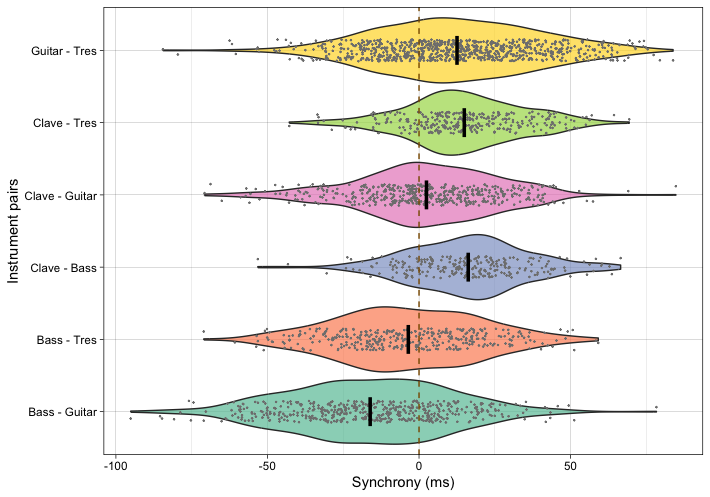

<!-- README.md is generated from README.Rmd. Please edit that file -->

# onsetsync - Analysis and Visualisation of Synchronisation of Music Onset Data

<!-- badges: start -->

[](https://lifecycle.r-lib.org/articles/stages.html#experimental)
<!-- badges: end -->

`onsetsync` is a R package for musical assessing synchrony between
onsets in music. There are functions for common operations such as
adding isochronous beats based on metrical structure, adding
annotations, calculating classic measures of synchrony between
performers, and assessing periodicity of the onsets, and visualising
synchrony across cycles, time, or another property.

For trying the package with notebooks, jump to <A HREF="#more">more
information</A>.

## Installation

You can install the current version of `onsetsync` from Github by
entering the following commands into R:

``` r
if (!require(devtools)) install.packages("devtools")
devtools::install_github("tuomaseerola/onsetsync")
```

## Usage

``` r
library(onsetsync)
library(dplyr)
library(ggplot2)
packageVersion("onsetsync")
#> [1] '0.4.5'
```

### Reading in data

Read onsets of one Cuban Son performance titled *Palo Santo* from *IEMP*
dataset at <https://osf.io/sfxa2/>. This song has the onsets and the
annotations about the metric cycles already extracted and defined and
**comes with the package**.

Go and <A HREF="https://osf.io/z9uxs/" target="_blank">listen to the
song at OSF</A>.

``` r
CSS_Song2 <- onsetsync::CSS_IEMP[[2]]   # Read one song from internal data
CSS_Song2 <- dplyr::select(CSS_Song2,Label.SD,SD,Clave,Bass,Guitar,Tres,
                           CycleTime,Cycle,Isochronous.SD.Time) # Select some columns
print(knitr::kable(head(CSS_Song2),format = "simple",digits = 2))
```

| Label.SD |  SD | Clave | Bass | Guitar | Tres | CycleTime | Cycle | Isochronous.SD.Time |
|:---------|----:|------:|-----:|-------:|-----:|----------:|------:|--------------------:|
| 1:1      |   1 |    NA |   NA |     NA |   NA |      5.04 |     1 |                5.04 |
| 1:2      |   2 |    NA |   NA |   5.28 |   NA |        NA |     1 |                5.26 |
| 1:3      |   3 |    NA |   NA |   5.48 |   NA |        NA |     1 |                5.48 |
| 1:4      |   4 |    NA | 5.71 |   5.71 | 5.73 |        NA |     1 |                5.71 |
| 1:5      |   5 |    NA | 5.93 |   5.94 | 5.92 |        NA |     1 |                5.93 |
| 1:6      |   6 |    NA |   NA |   6.15 | 6.14 |        NA |     1 |                6.15 |

Reading data from is easy either from CSV files in your computer or
directly from OSF using `get_OSF_csv` function.

### Visualise onsets structures

As an overview, we can visualise the onsets across the beat
sub-divisions for each instrument and do this across the time. Note that
time run vertically (from bottom to up) here.

``` r
fig1 <- plot_by_beat(df = CSS_Song2, 
                     instr = c('Bass','Clave','Guitar','Tres'), 
                     beat = 'SD', 
                     virtual='Isochronous.SD.Time',
                     pcols=2)
print(fig1)
```


### Calculate asynchronies

To what degree are the pairs of instruments synchronised to each other?
Let’s visualise the synchrony of all pairings of the instruments in this
example.

``` r
inst <- c('Clave','Bass','Guitar','Tres') # Define instruments 
dn <- sync_execute_pairs(CSS_Song2,inst,0,1,'SD')
fig2 <- plot_by_pair(dn)  # plot
print(fig2)  
```



As we saw in the first figure, the instruments usually play widely
different amounts of onsets in a piece, and these are bound to be at
different beats sub-divisions, the mutual amount of comparable onsets
for each pair often varies dramatically. Comparison of mean asynchronies
across sub-divisions can be facilitated by taking random samples of the
joint onsets. Here we choose a random 200 matching onsets and
re-calculate the comparison of asynchrony with this subset 1000 times.

``` r
set.seed(1234) # set random seed
N <- 200 # Let's select 200 onsets
Bootstrap <- 1000
d1 <- sync_sample_paired(CSS_Song2,'Clave','Bass',N,Bootstrap,'SD',TRUE)
#> [1] "onsets in common: 241"
print(paste('Mean asynchrony of',round(mean(d1$asynch*1000),1),
    'ms & standard deviation of',round(sd(d1$asynch*1000),1),'ms'))
#> [1] "Mean asynchrony of 16.2 ms & standard deviation of 19.5 ms"
```

There are other measures to summarise the asynchronies and visualise
them.

## More information

<a id="more">

For more examples, see [Get
started](https://tuomaseerola.github.io/onsetsync/articles/onsetsync.html)
or see the [function
reference](https://tuomaseerola.github.io/onsetsync/reference/index.html).

-   [Tutorial as a Rmarkdown
    notebook](https://github.com/tuomaseerola/onsetsync/blob/master/onsetsync.Rmd)
    which requires you to run the code in RStudio.

-   [Tutorial as a Jupyter
    notebook](https://github.com/tuomaseerola/onsetsync/blob/master/onsetsync.ipynb)
    which allows you to run the code in Colab (in your browser).
