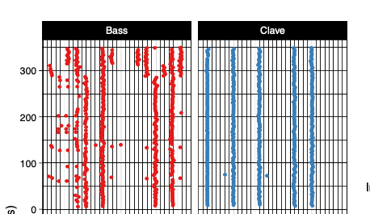

# Summary

Music performance relies on tight yet flexible timing between the performers. This entrainment between two or more performers can be analysed from the note onsets of recorded performances. The onset synchrony characterises the timing accuracy and dynamics within the performance. The synchrony between performers is influenced by various factors such as the genre of music, performer skills, and phrase and beat structures of the music. The analysis of the synchrony benefits from shared tools as several measures of synchrony will benefit from the same base code (e.g., comparing individual onsets to a virtual beat, or assessing the synchrony across other variables such as tempo, metrical hierarchy, or phrasing).

# Statement of need

`onsetsync` is a R package for musical dynamics. Python
enables wrapping low-level languages (e.g., C) for speed without losing
flexibility or ease-of-use in the user-interface. There are functions for  common operations such as adding isochronous beats based on metrical structure, adding annotations, calculating classic measures of synchrony, and periodicity, and visualising synchrony across cycles and time.

`onsetsync` was designed to be used by both empirical music researchers and by
students in courses on music and science and empirical musicology. It has already been used in a number of scientific publications [@fenner2012a]. Something more here

# Citations

Citations to entries in paper.bib should be in
[rMarkdown](http://rmarkdown.rstudio.com/authoring_bibliographies_and_citations.html)
format.

If you want to cite a software repository URL (e.g. something on GitHub without a preferred
citation) then you can do it with the example BibTeX entry below for @fidgit.

For a quick reference, the following citation commands can be used:
- `@author:2001`  ->  "Author et al. (2001)"
- `[@author:2001]` -> "(Author et al., 2001)"
- `[@author1:2001; @author2:2001]` -> "(Author1 et al., 2001; Author2 et al., 2002)"

# Figures

Figures can be included like this:

and referenced from text using \autoref{fig:example}.

Figure sizes can be customized by adding an optional second parameter:
{ width=20% }

# Acknowledgements

We acknowledge contributions from X, Y, and Z.

# References
